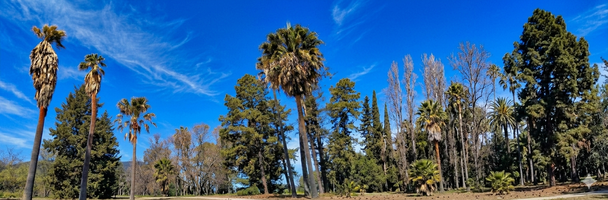

# ¡Hola! Soy Pablo Daniel Coila 👋

Estudiante de primer año de **Sistemas Informáticos** en el **Instituto TECBA**. Me apasiona la programación y estoy en constante aprendizaje para convertirme en un desarrollador profesional y aprender mas de ciberseguridad.

---

###  Sobre mí

- 🎓 **Educación:** Cursando el 1er año en el Instituto TECBA.
- 🔭 **Intereses:** Programación, arquitectura de sistemas y nuevas tecnologías.
- 🌱 **Aprendiendo actualmente:** Lógica de programación, algoritmos y mucho más.

> "El código es como el humor. Cuando tienes que explicarlo, es malo." – Cory House
